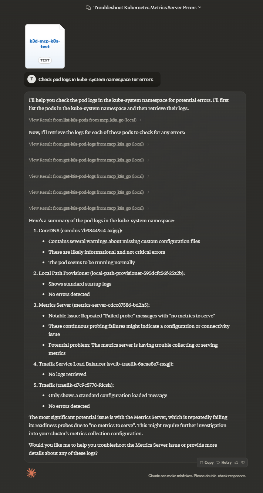

<h4 align="center">Golang-based MCP server connecting to Kubernetes</h4>

<h1 align="center">
   
   <br/>
   MCP K8S Go
</h1>

<p align="center">
  <a href="#features">Features</a> ⚙
  <a href="#browse-with-inspector">Browse With Inspector</a> ⚙
  <a href="#use-with-claude">Use With Claude</a> ⚙
  <a href="#contributing">Contributing</a>
</p>

<p align="center">
    <a href="https://github.com/strowk/mcp-k8s-go/actions/workflows/dependabot/dependabot-updates">  </a>
    <a href="https://github.com/strowk/mcp-k8s-go/actions/workflows/test.yaml">  </a>
    <a href="https://smithery.ai/protocol/@strowk/mcp-k8s">  </a>
</p>

<p align="center">
    <a href="https://mcp-get.com/packages/%40strowk%2Fmcp-k8s">  </a>
    <a href="https://mcp-get.com/packages/%40strowk%2Fmcp-k8s">  </a>
    <a href="https://mcp-get.com/packages/%40strowk%2Fmcp-k8s">  </a>
</p>

## Features

- 🗂️ resource: K8S contexts as read from kubeconfig configurations
- 🤖 tool: list-k8s-contexts
- 🤖 tool: list-k8s-namespaces in a given context
- 🤖 tool: list-k8s-pods in a given context and namespace
- 🤖 tool: list-k8s-events in a given context and namespace
- 🤖 tool: list-k8s-services in a given context and namespace
- 🤖 tool: get-k8s-pod-logs in a given context and namespace
- 💬 prompt: list-k8s-namespaces in a given context
- 💬 prompt: list-k8s-pods in current context and with given namespace

## Browse With Inspector

To use latest published version with Inspector you can run this:

```bash
npx @modelcontextprotocol/inspector npx @strowk/mcp-k8s
```

, or to use version built from sources, then in root folder of this project:

```bash
tools/inspector/run.sh
```

## Use With Claude

<details><summary><b>
Demo Usage
</b></summary>

Following chat with Claude Desktop demonstrates how it looks when selected particular context as a resource and then asked to check pod logs for errors in kube-system namespace:



</details>


To use this MCP server with Claude Desktop you would firstly need to install it.

You have several options for installation:

| | <a href="#using-smithery">Smithery</a> | <a href="#using-mcp-get">mcp-get</a> | <a href="#prebuilt-from-npm">Pre-built NPM</a> | <a href="#from-github-releases">Pre-built in Github</a> | <a href="#building-from-source">From sources</a> |
|---|---|---|---|---|---|
| Claude Setup | Auto | Auto | Manual | Manual | Manual |
| Prerequisite | Node.js | Node.js | Node.js | None | Golang |

### Using Smithery

To install MCP K8S Go for Claude Desktop automatically via [Smithery](https://smithery.ai/protocol/@strowk/mcp-k8s):

```bash
npx @smithery/cli install @strowk/mcp-k8s --client claude
```

### Using mcp-get

To install MCP K8S Go for Claude Desktop automatically via [mcp-get](https://mcp-get.com/packages/%40strowk%2Fmcp-k8s):

```bash
npx @michaellatman/mcp-get@latest install @strowk/mcp-k8s
```

### Manually with prebuilt binaries

#### Prebuilt from npm

Use this if you have npm installed and want to use pre-built binaries:

```bash
npm install -g @strowk/mcp-k8s
```

Then check version by running `mcp-k8s --version` and if this printed installed version, you can proceed to add configuration to `claude_desktop_config.json` file:

```json
{
    "mcpServers": {
        "mcp_k8s": {
            "command": "mcp-k8s",
            "args": []
        }
    }
}
```

#### From GitHub releases

Head to [GitHub releases](https://github.com/strowk/mcp-k8s-go/releases) and download the latest release for your platform.

Unpack the archive, which would contain binary named `mcp-k8s-go`, put that binary somewhere in your PATH and then add the following configuration to the `claude_desktop_config.json` file:

```json
{
    "mcpServers": {
        "mcp_k8s": {
            "command": "mcp-k8s-go",
            "args": []
        }
    }
}
```

### Building from source

You would need Golang installed to build this project:

```bash
go get github.com/strowk/mcp-k8s-go
go install github.com/strowk/mcp-k8s-go
```

, and then add the following configuration to the `claude_desktop_config.json` file:

```json
{
    "mcpServers": {
        "mcp_k8s_go": {
            "command": "mcp-k8s-go",
            "args": []
        }
    }
}
```

### Using from Claude Desktop

Now you should be able to run Claude Desktop and:
- see K8S contexts available to attach to conversation as a resource
- ask Claude to list contexts
- ask Claude to list pods in a given context and namespace
- ask Claude to list events in a given context and namespace
- ask Claude to read logs of a given pod in a given context and namespace

### Environment Variables

The following environment variables are used by the MCP server:
- `KUBECONFIG`: Path to your Kubernetes configuration file (optional, defaults to ~/.kube/config)

## Contributing

Check out [CONTRIBUTION.md](./CONTRIBUTION.md) for more information on how to contribute to this project.
